# Class Diagram: Quản lý tồn kho Shopee bằng Google Sheets

## 1. Cách hiểu class diagram

Vì hệ thống chủ yếu xử lý trên Google Sheets, các class trong diagram này không nhất thiết là class code OOP. Chúng được hiểu như sau:

- `<<Sheet>>`: một sheet dữ liệu gốc trong Google Sheets.
- `<<ReportView>>`: một sheet báo cáo/view tính từ dữ liệu gốc.
- `<<Processor>>`: logic xử lý bằng công thức, Apps Script, hoặc thao tác có kiểm soát trong Sheets.

Mục tiêu là làm rõ mỗi sheet giữ dữ liệu gì, xử lý nào đọc/ghi sheet nào, và quan hệ giữa các thành phần.

## 2. Mermaid Class Diagram

```mermaid
classDiagram
    class Products {
        <<Sheet>>
        +string odoo_product_key
        +string display_name
        +number quantity_on_hand
        +string unit
    }

    class ShopeeMapping {
        <<Sheet>>
        +string shopee_sku
        +MappingType mapping_type
        +string odoo_product_key
        +string mix_group_id
        +number conversion_qty
        +boolean active
        +string note
        +isFixedSku() boolean
        +isMixColor() boolean
        +validate() ValidationResult
    }

    class ShopeeCatalog {
        <<Sheet>>
        +string sku
        +string product_name
        +string variation_name
        +number stock
        +isSkuUsable() boolean
        +updateComputedStock(stock)
    }

    class ShopeeMappingComponent {
        <<Sheet>>
        +string shopee_sku
        +number component_no
        +string odoo_product_key
        +number component_qty
        +boolean active
        +string note
        +isActive() boolean
    }

    class MixColorOption {
        <<Sheet>>
        +string mix_group_id
        +string odoo_product_key
        +string display_name
        +boolean active
        +isSelectable() boolean
    }

    class ManualOrderInput {
        <<Sheet>>
        +string input_id
        +string order_batch_id
        +string order_id
        +string input_shopee_sku
        +string shopee_product_name
        +number order_qty
        +InputStatus input_status
        +string created_by
        +string note
        +isValidQty() boolean
        +markConverted()
        +markExported()
    }

    class OrderOutput {
        <<Sheet>>
        +string output_id
        +string input_id
        +string order_batch_id
        +string order_id
        +string input_shopee_sku
        +MappingType mapping_type
        +string odoo_product_key
        +string display_name
        +number required_qty
        +number selected_qty
        +StockStatus stock_status
        +ConfirmStatus confirm_status
        +isSelectionComplete() boolean
        +markConfirmed()
    }

    class ReturnInput {
        <<Sheet>>
        +string return_input_id
        +string return_batch_id
        +string order_id
        +string return_shopee_sku
        +string shopee_product_name
        +number return_qty
        +ReturnStatus return_status
        +string created_by
        +string note
        +isValidQty() boolean
        +markConverted()
        +markReceived()
    }

    class ReturnOutput {
        <<Sheet>>
        +string return_output_id
        +string return_input_id
        +string return_batch_id
        +string order_id
        +string return_shopee_sku
        +MappingType mapping_type
        +string odoo_product_key
        +string display_name
        +number return_required_qty
        +number selected_qty
        +ConfirmStatus confirm_status
        +isSelectionComplete() boolean
        +markConfirmed()
    }

    class InventoryTransaction {
        <<Sheet>>
        +string transaction_id
        +date transaction_date
        +TransactionType type
        +string odoo_product_key
        +number qty
        +ReferenceType reference_type
        +string reference_id
        +string source_input_id
        +string source_shopee_sku
        +MappingType source_mapping_type
        +OdooStatus odoo_status
        +string created_by
        +string note
        +isInbound() boolean
        +isOutbound() boolean
    }

    class InventoryReport {
        <<ReportView>>
        +string odoo_product_key
        +string display_name
        +number current_qty
        +number odoo_quantity_on_hand
        +number difference_qty
        +InventoryStatus status
        +refresh()
        +filterByProductKey(odoo_product_key)
        +filterByDisplayName(display_name)
        +showCurrentStock()
    }

    class DailyInboundReport {
        <<ReportView>>
        +date report_date
        +ReferenceType reference_type
        +string odoo_product_key
        +string display_name
        +number total_in_qty
        +number source_count
        +OdooStatus odoo_status
        +refresh(report_date)
    }

    class DailyOutboundReport {
        <<ReportView>>
        +date report_date
        +string odoo_product_key
        +string display_name
        +number total_out_qty
        +number source_order_count
        +refresh(report_date)
    }

    class OrderConversionProcessor {
        <<Processor>>
        +convertBatch(order_batch_id)
        +convertInput(input_id)
        +buildFixedSkuOutput(input)
        +buildMixColorRequirement(input)
        +calculateRequiredQty(order_qty, conversion_qty) number
        +validateMapping(shopee_sku) ValidationResult
    }

    class MixColorSelectionProcessor {
        <<Processor>>
        +listSelectableSkus(mix_group_id)
        +saveSelectedOdooProduct(input_id, odoo_product_key, selected_qty)
        +saveSelectedReturnProduct(return_input_id, odoo_product_key, selected_qty)
        +validateSelectedSkus(input_id) ValidationResult
        +validateSelectedReturnSkus(return_input_id) ValidationResult
        +validateSelectedTotal(input_id) ValidationResult
        +validateSelectedReturnTotal(return_input_id) ValidationResult
    }

    class ShopeeSkuSearchProcessor {
        <<Processor>>
        +searchSku(keyword)
        +filterUsableCatalogRows()
        +matchBySkuProductOrVariation(keyword)
        +returnSkuOptions(keyword)
    }

    class ShopeeStockProcessor {
        <<Processor>>
        +calculateShopeeStock(sku) number
        +calculateFixedSkuStock(mapping) number
        +calculateMixColorStock(mapping) number
        +calculateComboSkuStock(mapping) number
        +refreshShopeeCatalogStock()
    }

    class ReturnConversionProcessor {
        <<Processor>>
        +convertReturnBatch(return_batch_id)
        +convertReturnInput(return_input_id)
        +buildFixedSkuReturnOutput(input)
        +buildMixColorReturnRequirement(input)
        +calculateReturnRequiredQty(return_qty, conversion_qty) number
        +validateMapping(shopee_sku) ValidationResult
    }

    class StockProcessor {
        <<Processor>>
        +getCurrentQty(odoo_product_key) number
        +checkEnoughStock(odoo_product_key, qty) boolean
        +createInboundTransaction(odoo_product_key, qty)
        +createReturnInboundTransactions(return_input_id)
        +createOutboundTransactions(input_id)
        +createCancelReversal(transaction_id)
    }

    class ReportProcessor {
        <<Processor>>
        +refreshInventoryReport()
        +getCurrentStock(odoo_product_key) number
        +searchCurrentStock(keyword)
        +refreshDailyInboundReport(report_date)
        +refreshDailyOutboundReport(report_date)
    }

    Products "1" -- "0..*" ShopeeMapping : fixed odoo_product_key
    Products "1" -- "0..*" ShopeeMappingComponent : combo component
    Products "1" -- "0..*" MixColorOption : selectable odoo_product_key
    Products "1" -- "0..*" OrderOutput : selected odoo_product_key
    Products "1" -- "0..*" ReturnOutput : returned odoo_product_key
    Products "1" -- "0..*" InventoryTransaction : stock movement

    ShopeeCatalog "1" -- "0..1" ShopeeMapping : sku mapping
    ShopeeCatalog "1" -- "0..*" ManualOrderInput : selected sku
    ShopeeCatalog "1" -- "0..*" ReturnInput : returned sku

    ShopeeMapping "1" -- "0..*" ManualOrderInput : input_shopee_sku
    ShopeeMapping "1" -- "0..*" OrderOutput : input_shopee_sku
    ShopeeMapping "1" -- "0..*" ReturnInput : return_shopee_sku
    ShopeeMapping "1" -- "0..*" ReturnOutput : return_shopee_sku
    ShopeeMapping "1" -- "0..*" InventoryTransaction : source_shopee_sku
    ShopeeMapping "1" ..> "0..*" MixColorOption : uses mix_group_id
    ShopeeMapping "1" -- "1..*" ShopeeMappingComponent : combo components

    ManualOrderInput "1" --> "1..*" OrderOutput : produces
    ManualOrderInput "1" --> "0..*" InventoryTransaction : confirmed creates OUT
    OrderOutput "1" --> "0..1" InventoryTransaction : output source
    ReturnInput "1" --> "1..*" ReturnOutput : produces
    ReturnInput "1" --> "0..*" InventoryTransaction : confirmed creates IN
    ReturnOutput "1" --> "0..1" InventoryTransaction : return source


    InventoryReport ..> Products : reads
    InventoryReport ..> InventoryTransaction : sums qty
    DailyInboundReport ..> InventoryTransaction : filters IN
    DailyOutboundReport ..> InventoryTransaction : filters OUT

    OrderConversionProcessor ..> ManualOrderInput : reads and updates
    OrderConversionProcessor ..> ShopeeMapping : reads
    OrderConversionProcessor ..> ShopeeMappingComponent : reads combo components
    OrderConversionProcessor ..> OrderOutput : writes

    ShopeeSkuSearchProcessor ..> ShopeeCatalog : reads searchable SKU list
    ShopeeSkuSearchProcessor ..> ShopeeMapping : joins mapping status

    MixColorSelectionProcessor ..> MixColorOption : reads
    MixColorSelectionProcessor ..> OrderOutput : writes selected rows
    MixColorSelectionProcessor ..> ReturnOutput : writes selected return rows

    ReturnConversionProcessor ..> ReturnInput : reads and updates
    ReturnConversionProcessor ..> ShopeeMapping : reads
    ReturnConversionProcessor ..> ShopeeMappingComponent : reads combo components
    ReturnConversionProcessor ..> ReturnOutput : writes

    StockProcessor ..> Products : validates SKU
    StockProcessor ..> OrderOutput : reads output rows
    StockProcessor ..> ReturnOutput : reads return rows
    StockProcessor ..> InventoryTransaction : writes transactions

    ShopeeStockProcessor ..> ShopeeCatalog : writes computed stock
    ShopeeStockProcessor ..> ShopeeMapping : reads conversion
    ShopeeStockProcessor ..> ShopeeMappingComponent : reads combo components
    ShopeeStockProcessor ..> MixColorOption : reads mix options
    ShopeeStockProcessor ..> InventoryReport : reads current_qty


    ReportProcessor ..> InventoryReport : refreshes
    ReportProcessor ..> DailyInboundReport : refreshes
    ReportProcessor ..> DailyOutboundReport : refreshes
```



## 3. Logical classes theo sheet

### `Products`

Master mã Odoo. Đây là sheet nền để mọi giao dịch tồn kho và mapping tham chiếu tới.

Trách nhiệm:

- Lưu `Display Name`, `Quantity On Hand` và `Unit` từ Odoo export.
- Dùng `odoo_product_key`, mặc định bằng `display_name`, làm khóa mapping.

### `ShopeeMapping`

Master quy đổi mã Shopee.

Trách nhiệm:

- Tham chiếu `ShopeeCatalog.sku`.
- Xác định mã Shopee là `FIXED_SKU`, `MIX_COLOR` hay `COMBO_SKU`.
- Với `FIXED_SKU`, giữ `odoo_product_key` cố định.
- Với `MIX_COLOR`, giữ `mix_group_id`.
- Lưu `conversion_qty`.

### `ShopeeMappingComponent`

Danh sách thành phần Odoo của mã Shopee `COMBO_SKU`.

Trách nhiệm:

- Lưu mỗi mã Odoo thành phần và số lượng cần cho 1 đơn vị Shopee SKU.
- Cho phép một SKU Shopee tạo nhiều dòng xuất/nhập tồn theo nhiều mã Odoo.
- Ví dụ: `PEN-REFILL-BUNDLE` gồm 2 `BUT-BI-XANH` và 2 `NGOI-BUT`.

### `ShopeeCatalog`

Danh mục sản phẩm/variation export từ Shopee.

Trách nhiệm:

- Lưu `sku`, `product_name`, `variation_name` từ Shopee export.
- Cột `stock` là tồn Shopee được tính từ tồn Odoo/Sheets sau mapping.
- Là nguồn danh sách chọn/search mã Shopee trên màn hình xuất kho và nhập hoàn.
- Không dùng được các dòng export bị trống `sku`.

### `MixColorOption`

Danh sách SKU Odoo được phép chọn cho mã mix màu.

Trách nhiệm:

- Giới hạn danh sách mã Odoo hợp lệ khi người dùng xử lý mã `MIX_COLOR`.
- Tránh chọn nhầm mã Odoo ngoài nhóm.

### `ManualOrderInput`

Sheet nhập danh sách dòng hàng Shopee cần xuất.

Trách nhiệm:

- Lưu nhiều dòng Shopee SKU trong cùng một `order_batch_id`.
- Cho phép người dùng chọn mã Shopee từ danh sách có search theo mã và tên variation.
- Mỗi dòng có `input_id` để chống xuất trùng.
- Lưu trạng thái xử lý dòng đơn.

### `OrderOutput`

Sheet kết quả cần xuất.

Trách nhiệm:

- Với `FIXED_SKU`, lưu mã Odoo và số lượng cần xuất do hệ thống quy đổi.
- Với `MIX_COLOR`, lưu các mã Odoo và số lượng do người dùng chọn khi xuất.
- Với `COMBO_SKU`, lưu từng mã Odoo component và số lượng cần xuất theo `component_qty`.
- Là nguồn để tạo transaction `OUT`.

### `ReturnInput`

Sheet nhập danh sách hàng hoàn/trả thủ công theo thông tin Shopee.

Trách nhiệm:

- Lưu nhiều dòng Shopee SKU trong cùng một `return_batch_id`.
- Cho phép người dùng chọn mã Shopee từ danh sách có search theo mã và tên variation.
- Lưu mã Shopee và số lượng Shopee khách đã đặt/trả.
- Mỗi dòng có `return_input_id` để chống nhập hoàn trùng.
- Là input để quy đổi hàng hoàn về mã Odoo.

### `ReturnOutput`

Sheet kết quả quy đổi hàng hoàn về mã Odoo.

Trách nhiệm:

- Với `FIXED_SKU`, lưu mã Odoo và số lượng cần nhập lại do hệ thống quy đổi.
- Với `MIX_COLOR`, lưu các mã Odoo và số lượng do người dùng chọn khi kiểm hàng hoàn.
- Với `COMBO_SKU`, lưu từng mã Odoo component và số lượng cần nhập lại theo `component_qty`.
- Là nguồn để tạo transaction `IN` với `reference_type = RETURN_FROM_CUSTOMER`.

### `InventoryTransaction`

Nguồn sự thật của tồn kho.

Trách nhiệm:

- Lưu mọi biến động tồn: `IN`, `OUT`, `ADJUST`, `CANCEL_REVERSAL`.
- Tồn hiện tại luôn tính từ tổng `qty`.
- Không xóa dòng `OUT` đã tạo; nếu sai thì tạo dòng đảo.

## 4. Processor classes

Các processor này không bắt buộc là code class. Trong MVP, chúng có thể là:

- Công thức Google Sheets.
- Data validation.
- Filter/view.
- Apps Script nếu cần nút bấm.

### `OrderConversionProcessor`

Xử lý danh sách dòng nhập đơn.

Input:

- `ManualOrderInput`
- `ShopeeMapping`

Output:

- `OrderOutput`

Logic chính:

```text
required_qty = order_qty * conversion_qty
combo_required_qty = order_qty * component_qty
```

Processor này chạy theo từng `order_batch_id`, nhưng kết quả vẫn được ghi theo từng `input_id` để chống xác nhận trùng.

### `ShopeeSkuSearchProcessor`

Xử lý danh sách chọn mã Shopee trên UI.

Input:

- `ShopeeCatalog`
- `ShopeeMapping`

Output:

- Danh sách option gồm `sku`, `product_name`, `variation_name`, `mapping_type`, `conversion_qty`.

Rule:

```text
search_keyword matches sku OR product_name OR variation_name
sku is not blank
```

### `ShopeeStockProcessor`

Tính cột `stock` trên danh mục Shopee từ tồn Odoo/Sheets.

Input:

- `ShopeeCatalog`
- `ShopeeMapping`
- `ShopeeMappingComponent`
- `InventoryReport`
- `MixColorOption`

Output:

- `ShopeeCatalog.stock`

Rule:

```text
FIXED_SKU stock = FLOOR(current_qty of mapped odoo_product_key / conversion_qty)
MIX_COLOR stock = FLOOR(SUM(current_qty of active mix options) / conversion_qty)
COMBO_SKU stock = MIN(FLOOR(current_qty of component odoo_product_key / component_qty))
```

### `MixColorSelectionProcessor`

Xử lý chọn mã Odoo cho mã mix màu.

Input:

- `MixColorOption`
- `OrderOutput`
- `ReturnOutput`

Rule:

```text
SUM(selected_qty by input_id) = required_qty
SUM(selected_qty by return_input_id) = return_required_qty
selected odoo_product_key must exist in MixColorOption
```

### `ReturnConversionProcessor`

Xử lý danh sách dòng hàng hoàn theo mã Shopee.

Input:

- `ReturnInput`
- `ShopeeMapping`

Output:

- `ReturnOutput`

Logic chính:

```text
return_required_qty = return_qty * conversion_qty
combo_return_required_qty = return_qty * component_qty
```

Processor này chạy theo từng `return_batch_id`, nhưng kết quả vẫn được ghi theo từng `return_input_id` để chống xác nhận nhập hoàn trùng.

### `StockProcessor`

Xử lý tồn kho.

Input:

- `Products`
- `OrderOutput`
- `ReturnOutput`
- `InventoryTransaction`

Output:

- Transaction `IN`, `OUT`, `CANCEL_REVERSAL`.

Rule:

```text
current_qty = SUM(InventoryTransaction.qty by odoo_product_key)
```

### `ReportProcessor`

Làm mới 3 báo cáo:

- `InventoryReport`
- `DailyInboundReport`
- `DailyOutboundReport`

Riêng xem tồn kho hiện tại dùng `InventoryReport`:

```text
current_qty = SUM(InventoryTransaction.qty by odoo_product_key)
```

Người dùng xem trực tiếp trên sheet `Inventory_Report`, có thể lọc theo mã Odoo hoặc tên sản phẩm.

## 5. Enum đề xuất

```text
MappingType = FIXED_SKU | MIX_COLOR | COMBO_SKU

TransactionType = IN | OUT | ADJUST | CANCEL_REVERSAL

ReferenceType = TRANSFER_FROM_MAIN | RETURN_FROM_CUSTOMER | SHOPEE_ORDER | STOCKTAKE

InputStatus = Mới | Đã quy đổi | Thiếu mapping | Thiếu tồn | Chưa chọn mã Odoo | Đã xuất kho

ReturnStatus = Mới | Đã quy đổi | Thiếu mapping | Chưa chọn mã Odoo | Đã nhập kho

StockStatus = Đủ hàng | Thiếu hàng

ConfirmStatus = Chưa xác nhận | Đã xuất kho | Đã nhập kho | Lỗi

OdooStatus = Chờ ghi nhận Odoo | Đã ghi nhận Odoo | Không cần ghi nhận

InventoryStatus = OK | Âm tồn | Lệch Odoo | Sắp hết
```

## 6. Mapping class sang Google Sheets

| Logical class | Google Sheet |
| --- | --- |
| `Products` | `Products` |
| `ShopeeCatalog` | `Shopee_Catalog` |
| `ShopeeMapping` | `Shopee_Mapping` |
| `ShopeeMappingComponent` | `Shopee_Mapping_Components` |
| `MixColorOption` | `Mix_Color_Options` |
| `ManualOrderInput` | `Manual_Order_Input` |
| `OrderOutput` | `Order_Output` |
| `ReturnInput` | `Return_Input` |
| `ReturnOutput` | `Return_Output` |
| `InventoryTransaction` | `Inventory_Transactions` |
| `InventoryReport` | `Inventory_Report` |
| `DailyInboundReport` | `Daily_Inbound_Report` |
| `DailyOutboundReport` | `Daily_Outbound_Report` |
