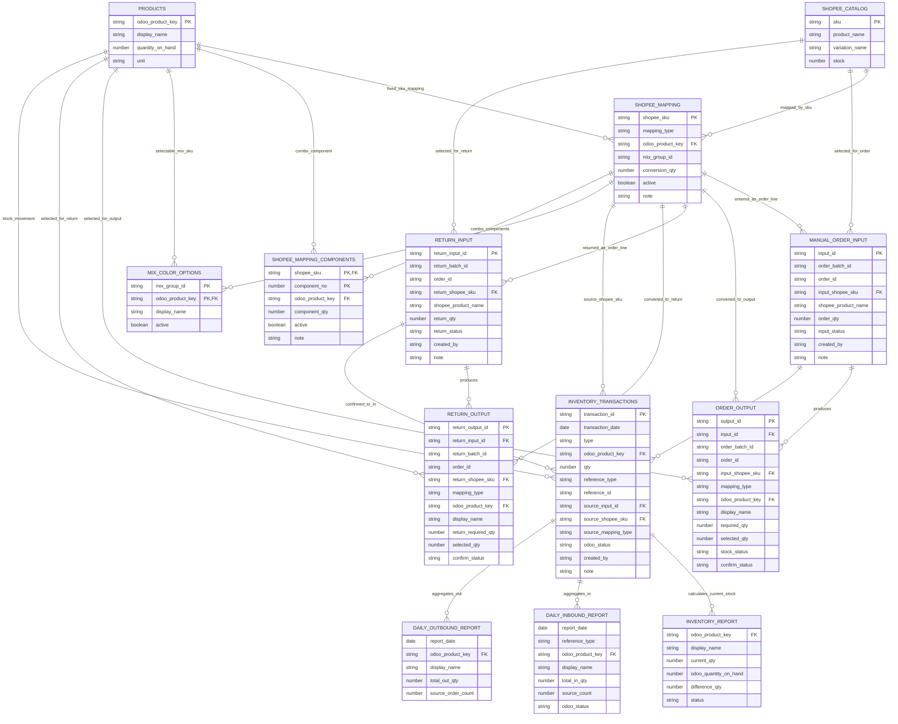

# ERD: Quản lý tồn kho Shopee bằng Google Sheets

## 1. Ghi chú thiết kế

ERD này được suy ra từ `PRD.md` và giữ đúng scope MVP:

- Google Sheets là database vận hành.
- Người dùng nhập đơn Shopee thủ công.
- Người dùng nhập hàng hoàn theo mã Shopee rồi hệ thống quy đổi về mã Odoo để nhập lại tồn.
- Mapping Shopee có 3 loại: `FIXED_SKU`, `MIX_COLOR` và `COMBO_SKU`.
- Khi xác nhận xuất kho, hệ thống tạo transaction `OUT` ngay.
- Cuối ngày xem `Daily_Outbound_Report` để lấy số liệu xuất hóa đơn thủ công.
- Các báo cáo tồn/nhập/xuất là view tính toán từ bảng gốc, không phải nguồn dữ liệu chính.

Để chống xác nhận trùng, hệ thống sử dụng `input_id` cho dòng xuất, `return_input_id` cho dòng nhập hoàn, và lưu khóa nguồn vào `Inventory_Transactions.source_input_id`.

## 2. Mermaid ERD



## 3. Bảng gốc

### `Products`

Master sản phẩm import từ Odoo export.

Khóa:

- PK: `odoo_product_key`

Field lấy từ Odoo export:

- `display_name`
- `quantity_on_hand`
- `unit`

Ghi chú:

- Odoo export hiện không có SKU riêng.
- `odoo_product_key` mặc định bằng `display_name`.
- Số tồn Odoo dùng để đối soát chỉ là `quantity_on_hand`.

### `Shopee_Mapping`

Master mapping từ mã Shopee sang Odoo.

Rule:

- `shopee_sku` tham chiếu `Shopee_Catalog.sku`.
- `mapping_type` chỉ nhận `FIXED_SKU`, `MIX_COLOR` hoặc `COMBO_SKU`.
- `conversion_qty > 0` với `FIXED_SKU` và `MIX_COLOR`.
- `FIXED_SKU` phải có `odoo_product_key`.
- `MIX_COLOR` phải có `mix_group_id`.
- `COMBO_SKU` phải có ít nhất 1 dòng active trong `Shopee_Mapping_Components`.

### `Shopee_Mapping_Components`

Danh sách thành phần Odoo cho mã Shopee `COMBO_SKU`.

Rule:

- Khóa chính: `shopee_sku + component_no`.
- `shopee_sku` tham chiếu `Shopee_Mapping.shopee_sku`.
- `odoo_product_key` tham chiếu `Products.odoo_product_key`.
- `component_qty > 0`.
- Khi xuất/nhập hoàn, số lượng mỗi component = số lượng Shopee * `component_qty`.

### `Shopee_Catalog`

Danh mục sản phẩm/variation export từ Shopee.

Rule:

- Chỉ quan tâm các cột `SKU`, `Product Name`, `Variation Name`, `Stock`.
- `sku` là khóa để search, chọn dòng hàng, và mapping.
- `product_name` và `variation_name` dùng để hỗ trợ search và đối chiếu.
- `stock` là số tính từ tồn Odoo/Sheets sau mapping, không lấy trực tiếp từ tồn Shopee export.
- Dòng không có `sku` chưa dùng được cho xử lý đơn hoặc nhập hoàn.

### `Mix_Color_Options`

Danh sách mã Odoo người dùng được phép chọn khi mã Shopee là mix màu.

Khóa:

- Composite PK: `mix_group_id + odoo_product_key`

### `Return_Input`

Dòng hàng hoàn/trả do người dùng nhập theo thông tin Shopee.

Rule:

- Người dùng nhập/paste danh sách dòng hàng Shopee trong cùng một `return_batch_id`.
- Mỗi dòng có `order_id`, `return_shopee_sku`, `shopee_product_name`, `return_qty`.
- UI chọn `return_shopee_sku` cần hỗ trợ search theo `sku`, `product_name` và `variation_name` từ `Shopee_Catalog`.
- `return_qty` là số lượng Shopee khách trả, chưa phải số lượng Odoo; có thể mặc định bằng số lượng khách đặt nếu trả toàn bộ.
- `return_input_id` dùng để chống xác nhận nhập hoàn trùng.

### `Manual_Order_Input`

Dòng hàng Shopee cần xử lý xuất kho.

Rule:

- Người dùng nhập/paste danh sách dòng hàng Shopee trong cùng một `order_batch_id`.
- Mỗi dòng có `order_id`, `input_shopee_sku`, `shopee_product_name`, `order_qty`.
- UI chọn `input_shopee_sku` cần hỗ trợ search theo `sku`, `product_name` và `variation_name` từ `Shopee_Catalog`.
- `input_id` dùng để chống xác nhận xuất trùng từng dòng.

### `Return_Output`

Kết quả quy đổi hàng hoàn từ mã Shopee sang mã Odoo.

Rule:

- `FIXED_SKU`: hệ thống tự lấy `odoo_product_key` và tính `return_required_qty = return_qty * conversion_qty`.
- `MIX_COLOR`: người dùng chọn mã Odoo thực tế nhận về và nhập `selected_qty`.
- `COMBO_SKU`: hệ thống tạo nhiều dòng theo `Shopee_Mapping_Components`, mỗi dòng có `return_required_qty = return_qty * component_qty`.
- Là nguồn để tạo transaction `IN` với `reference_type = RETURN_FROM_CUSTOMER`.

### `Inventory_Transactions`

Nguồn sự thật của tồn kho.

Rule:

- `IN`: `qty > 0`
- `OUT`: `qty < 0`
- `CANCEL_REVERSAL`: `qty > 0`
- Không sửa/xóa transaction `OUT` đã tạo; nếu sai thì tạo dòng đảo.
- Hàng hoàn tạo `IN` với `reference_type = RETURN_FROM_CUSTOMER`.
- Hàng hoàn `FIXED_SKU` lấy mã Odoo từ `Shopee_Mapping`.
- Hàng hoàn `MIX_COLOR` lấy mã Odoo do người dùng chọn trong `Return_Output`.
- Hàng hoàn `COMBO_SKU` lấy mã Odoo component từ `Shopee_Mapping_Components`.

## 4. Report view

### `Inventory_Report`

```text
current_qty = SUM(Inventory_Transactions.qty WHERE odoo_product_key = current_product_key)
difference_qty = current_qty - odoo_quantity_on_hand
```

### `Daily_Inbound_Report`

```text
total_in_qty = SUM(qty WHERE type = "IN" AND transaction_date = report_date GROUP BY reference_type, odoo_product_key)
```

### `Daily_Outbound_Report`

```text
total_out_qty = ABS(SUM(qty WHERE type = "OUT" AND transaction_date = report_date GROUP BY odoo_product_key))
```

Người dùng lấy số liệu từ `Daily_Outbound_Report` để xuất hóa đơn thủ công.
